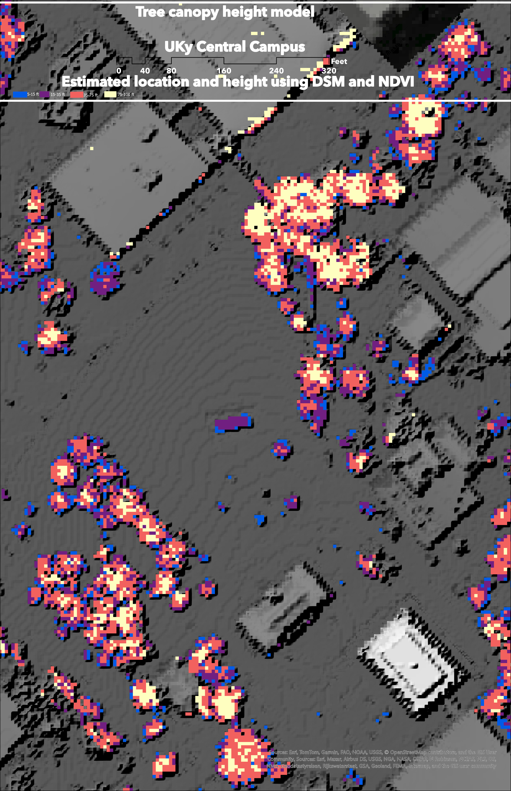
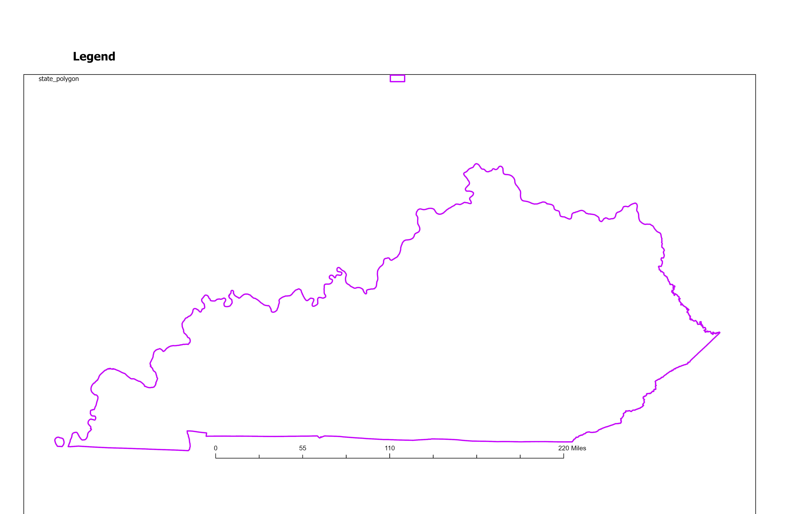

# Hello trees

A map made from Lidar dervied surface elevations and made in ArcGIS Pro/ Spring 2025 for field trip 

* Data from kyraster.ky gov
* NDVI greater 0.1 values used to fidn vegetated areas 
* Heights greater 5 feet 

## My State Map

*Download [GeoPDF](RealLandcover.pdf)*

## My Tree Canopy Campus Model

*Download [GeoPDF](Layout_Tree_Canopy_Model.pdf)*

[Visit my webpage](https://hyperplaced.github.io/Hello-World/)

## My map image

## Kentucky Outline

   
*Download [GeoPDF](ky-outline.pdf)*
